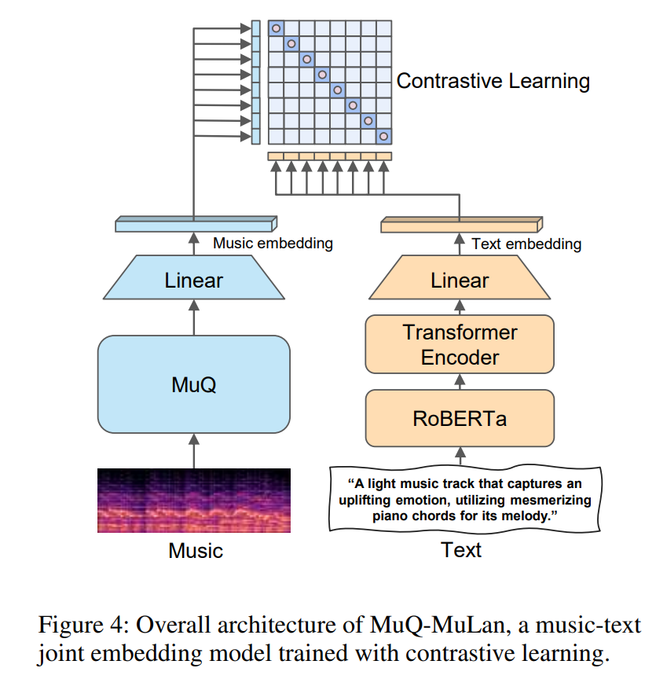

# MuQ & MuQ-MuLan PyTorch

  

PyTorch implementation of MuQ & MuQ-MuLan.

[MuQ & MuQ-MuLan](https://arxiv.org/abs/2501.01108): Self-Supervised Music Representation Learning with Mel Residual Vector Quantization.
